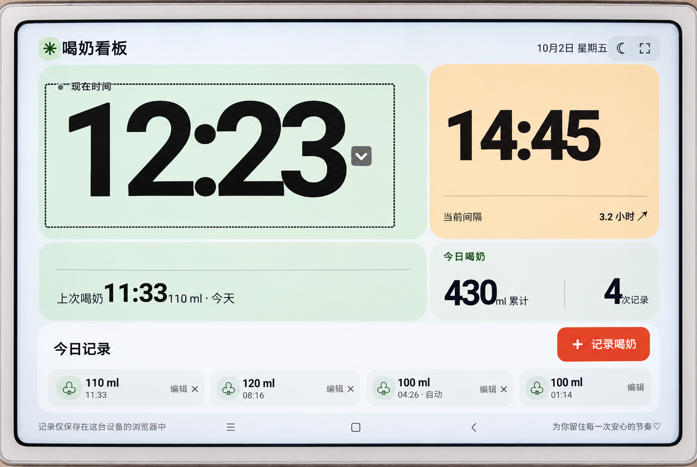

# Baby Feeding Dashboard

[简体中文](README.md) | [English](README.en.md)

A baby feeding dashboard designed for tablets in landscape orientation. Large numbers show the current time, the last feeding, and the next scheduled feeding. Manage feeding records, view milk intake statistics, and switch to night mode.

Built with HTML, CSS, JavaScript, and Node.js, with no third-party runtime dependencies. The web version saves records on the computer running the server and keeps a synchronized browser copy. The standalone Android app stores records on the device.

## Features

- **Time dashboard:** Current time, last feeding time and amount, and the next scheduled feeding time.
- **Record management:** Add, edit, and delete records; view today's milk intake and feeding count.
- **Feeding intervals:** Set an interval and automatically create a record when the scheduled time arrives while the app is open.
- **Data storage:** Server persistence for the web version, local storage for Android, and CSV backup and restore.
- **Tablet experience:** Landscape layout, large text, night mode, and fullscreen, including support for the Xiaomi MI PAD 4.

## On-device Preview (MI PAD 4)



*Photographed on a Xiaomi MI PAD 4; the display image has been adjusted for perspective, reflections, and moiré.*

## iPad App

An installation project is available for iPadOS 15 and later, with landscape orientation, offline records, night mode, and milk intake statistics. Install it with Xcode and your own Apple ID. See the [iPad installation guide (Chinese)](ios/README.md).

## Android App

The standalone app supports Android 6.0 and later. The UI is bundled in the APK, and records are stored on the device. It uses landscape orientation, fullscreen, and keeps the screen awake. Phones use a compact landscape layout with scrollable dialogs. Everyday use requires neither a computer nor an internet connection.

Download the APK from [GitHub Releases](https://github.com/kalaGN/baby-feeding-dashboard/releases/latest) or the [Gitee download mirror](https://gitee.com/AiLbai/baby-feeding-dashboard/releases/latest). Open download links in a browser, rather than inside WeChat. See the [Android installation and build guide (Chinese)](android/README.md) for installation and migration instructions.

The Android app supports CSV export, restore after preview and confirmation, and importing records from the web server after confirmation.

## Quick Start

### Requirements

- Node.js 22, the verified runtime version.
- The server computer and tablet must be connected to the same local network.

### Download and Run

```bash
git clone https://github.com/kalaGN/baby-feeding-dashboard.git
cd baby-feeding-dashboard
node server.mjs
```

No dependency installation or build step is required.

1. Open `http://localhost:4173` on the computer.
2. Find the computer's local IP address. On macOS, check System Settings → Wi-Fi.
3. Open `http://<computer-local-ip>:4173` on the tablet and use it in landscape orientation.

Keep the computer awake and the server running. To migrate existing browser records, first open the page in the tablet browser that holds those records.

### Configuration

| Environment variable | Default | Purpose |
| --- | --- | --- |
| `PORT` | `4173` | Server port |
| `MILK_BOARD_DATA_DIR` | `data/` in the project directory | Data storage directory |

Example for macOS or Linux:

```bash
PORT=8080 MILK_BOARD_DATA_DIR=/path/to/milk-board-data node server.mjs
```

## Usage

### Feeding Records

- **Add:** Tap **＋**, select the month, day, hour, and minute, choose a milk amount, and save. The default is **120 ml**. Scroll vertically to select **10–300 ml** in **10 ml** steps. No year selection is required.
- **Edit:** Tap a record or its pencil icon to change the time or amount.
- **Delete:** Tap **×** on the right of a record and confirm.

New records use the current year. When selecting December in January, the previous year is used. Editing a record preserves its original year.

### Intervals and Automatic Records

Tap the current interval to adjust hours and minutes. For example, **3.1 hours equals 3 hours and 6 minutes**.

When the page is open and the scheduled time arrives, an automatic record is added using the previous record's milk amount. With no previous records, timing starts when the interval is set, and the first automatic record uses **120 ml**.

Automatic records can be edited or deleted. Missed intervals while the page is closed are not added later.

### Milk Intake Statistics

Tap the statistics icon in today's milk intake section to view daily charts, total intake, and average daily intake for the last **7 or 30 days**. The period includes today. Days without records count as zero; the average uses the full selected period and is rounded to the nearest milliliter. The 30-day chart scrolls horizontally.

### Night Mode and Fullscreen

- Tap the moon icon to switch night mode. Your choice is remembered.
- In the web version, tap the fullscreen icon to enter or exit fullscreen.
- If the tablet still turns its screen off, adjust the sleep timeout in the device's display settings.

## Data Management

### Web Storage and Migration

When the server has no data, the web page imports existing browser records and the interval into the server. Subsequent changes are saved temporarily on the tablet, then synchronized to the server's `state.json`.

If the server already has data, the page loads its records. Unsynchronized local changes are retried. Conflicts produce a message and preserve a local copy. Before clearing browser data, make sure no synchronization failure is shown.

The default data file is `data/state.json`. This directory is ignored by Git and is not uploaded with the source code.

### CSV Backup and Restore

Tap the gear beside the app title → **Backup and Restore**. Export all feeding records as a UTF-8 CSV file. Restoring a CSV shows the record count, date range, and replacement warning before confirmation. Confirming replaces all records; cancellation or validation failure leaves records unchanged.

CSV backups preserve record IDs, dates, times, milk amounts, automatic-record flags, and exact timestamps. They do not include interval or night mode settings. Restore supports files exported by this app, with limits of **1 MB and 10,000 records**. Avoid manually editing backups.

Android uses the system file picker, iPad uses Files, and the web version uses browser downloads and file selection. Android's server restore option lets you enter a server address and confirm the imported records. See [CSV backup details (Chinese)](docs/csv-backup.md).

### Server File Backup and Restore

1. Stop the server and copy `data/state.json` to a safe location.
2. To restore, stop the server, replace `state.json` with the backup, and restart the server.

Move the data directory together with the application when changing computers or deployment locations.

## Deployment Notes

- The server listens on `0.0.0.0` for access within the local network.
- There is no login authentication. Anyone on the same network who knows the address can read or modify records. Use a trusted local network.
- In the web version, automatic records require both the server and the tablet page to remain running.
- A local HTTP address does not guarantee home-screen installation or offline caching.
- Server persistence requires `server.mjs`; hosting only `dist/` on a static website does not provide it.

## Project Structure

```text
baby-feeding-dashboard/
├── android/                    # Android app and APK build configuration
├── ios/                        # iPad installation project
├── dist/                       # Web UI, styles, scripts, and icons
├── docs/                       # Guides and screenshots
├── tests/                      # Record logic and persistence tests
├── server.mjs                  # Web server and record storage API
├── data/state.json             # Runtime data, excluded from Git
├── SPEC.md                     # Functional and implementation specification
├── AGENTS.md                   # Project rules
├── README.md                   # Chinese documentation
├── README.en.md                # English documentation
└── LICENSE
```

## Development and Verification

Edit files in `dist/` directly; no build is required for the web version. When updating frontend resources, update the cache versions in `index.html` and `sw.js`.

```bash
node --check dist/app.js
node --check dist/sw.js
node --check server.mjs
node --test tests/*.test.mjs
```

Tests cover automatic records, date and interval inputs, legacy migration, conflict protection, and persistence across server restarts.

### Android Releases

Every new APK published to GitHub Releases must also be uploaded to the [Gitee download repository](https://gitee.com/AiLbai/baby-feeding-dashboard) under the same version tag. Use the same signed APK and name the Gitee attachment `baby-feeding-dashboard.apk`. Do not upload project source code to Gitee.

Verify that both download links work and the downloaded APKs have matching SHA-256 hashes before reporting a release as complete. See [project rules (Chinese)](AGENTS.md).

## Contributing

Report bugs or suggestions through [Issues](https://github.com/kalaGN/baby-feeding-dashboard/issues), or open a pull request. Include relevant verification when changing record or synchronization logic. Do not commit personal feeding records or other private data.

## License

Released under the [MIT License](LICENSE). Preserve the copyright and permission notice when using, modifying, or distributing the project.
